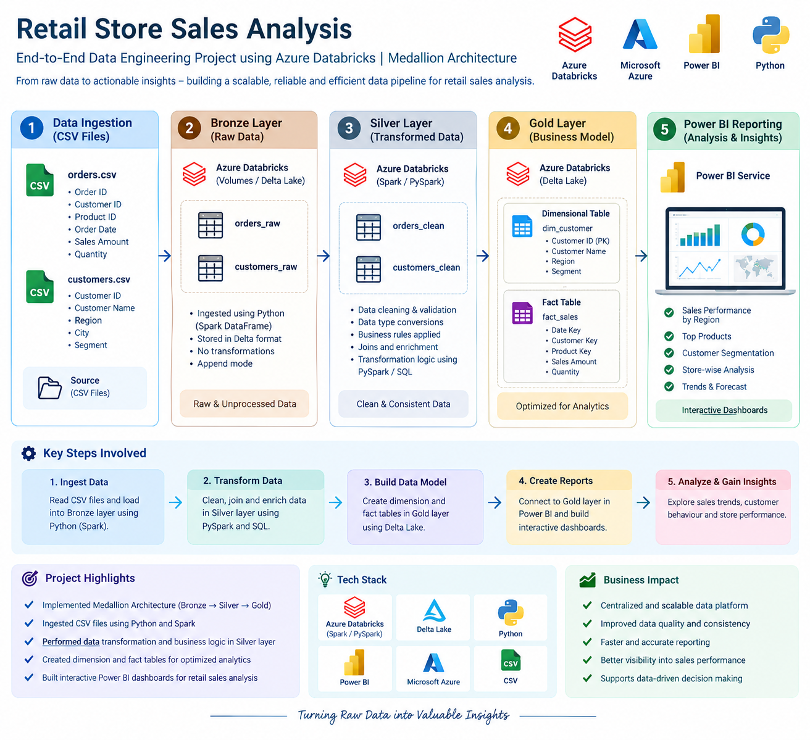

# Retail Store Sales Analysis – End-to-End Databricks Project

> An end-to-end data engineering and analytics project built using **Azure Databricks, Medallion Architecture, Delta Lake, Python/PySpark, and Power BI**.

[](https://azure.microsoft.com/en-us/products/databricks)
[](https://www.python.org/)
[](https://powerbi.microsoft.com/)

---

## 📌 Project Overview

**Retail Store Sales Analysis** demonstrates how raw retail data can be transformed into a structured, analytics-ready data model using **Azure Databricks and the Medallion Architecture**.

The project starts with raw **Orders** and **Customers** CSV files, processes them through **Bronze, Silver, and Gold layers**, and finally uses the Gold layer as the data source for a **Power BI dashboard**.

### End-to-End Flow

**CSV Files → Bronze → Silver → Gold → Power BI**

---

## 🎯 Business Use Case

A retail business needs a reliable way to analyze sales and customer data across products, categories, customers, locations, and time.

The objective of this project is to create a scalable data pipeline that converts raw source data into clean and business-ready datasets for reporting and decision-making.

The final solution enables analysis of:

- Sales and revenue performance
- Order and quantity trends
- Product performance
- Category-wise sales
- Customer demographics
- Customer loyalty
- Geographical performance
- Time-based sales trends

---

## ❗ Problem Statement

Raw Orders and Customers data is available in CSV format, but it is not directly optimized for business reporting.

The business needs a solution to:

- Ingest raw data into a data platform
- Preserve source data
- Clean and transform inconsistent data
- Combine customer and sales information
- Create an analytics-ready data model
- Provide a single trusted source for Power BI reporting

---

## 💡 Solution

The solution uses **Azure Databricks with Medallion Architecture** to separate data processing into three logical layers.

### 🥉 Bronze Layer – Raw Data

The Bronze layer stores the ingested source data with minimal transformation.

**Source:**
- `orders.csv`
- `customers.csv`

**Activities:**
- Read source CSV files from a Databricks Volume
- Ingest raw data into Delta tables
- Preserve the source-level information for downstream processing

---

### 🥈 Silver Layer – Clean & Transform

The Silver layer prepares the raw data for analytical use.

**Activities include:**
- Data cleansing
- Data type handling
- Transformation and standardization
- Joining relevant datasets
- Preparing clean datasets for the Gold layer

---

### 🥇 Gold Layer – Business-Ready Data

The Gold layer contains the final analytical data model used for reporting.

Key analytical tables include:

- `dim_customer`
- `gold_fact_sales`

The Gold fact table contains business-oriented fields such as:

- Product information
- Customer information
- Category
- Order date
- Year / Month
- Gender
- City / State
- Loyalty points
- Revenue
- Quantity
- Order metrics
- Average metrics

This layer acts as the trusted source for Power BI analysis.

---

## 🏗️ Architecture



### Architecture Flow

```text
                 SOURCE
        ┌─────────────────────┐
        │     orders.csv      │
        │   customers.csv     │
        └──────────┬──────────┘
                   │
                   ▼
        ┌─────────────────────┐
        │  Azure Databricks   │
        │      Volumes        │
        └──────────┬──────────┘
                   │
                   ▼
        ┌─────────────────────┐
        │   🥉 BRONZE LAYER   │
        │     Raw / Delta     │
        └──────────┬──────────┘
                   │
                   ▼
        ┌─────────────────────┐
        │   🥈 SILVER LAYER   │
        │ Clean & Transform   │
        └──────────┬──────────┘
                   │
                   ▼
        ┌─────────────────────┐
        │    🥇 GOLD LAYER    │
        │                     │
        │   dim_customer      │
        │   gold_fact_sales   │
        └──────────┬──────────┘
                   │
                   ▼
        ┌─────────────────────┐
        │      Power BI       │
        │ Dashboard & Analysis│
        └─────────────────────┘
```

---

## 📊 Power BI Dashboard

The Gold layer is connected to Power BI to provide interactive business analysis.


### Key Dashboard Analysis

The dashboard can be used to analyze:

| Analysis Area | Business Questions |
|---|---|
| **Revenue** | How is revenue performing over time? |
| **Orders** | How many orders are being generated? |
| **Quantity** | What is the sales volume? |
| **Products** | Which products contribute most to revenue? |
| **Categories** | Which product categories perform best? |
| **Customers** | Who are the key customer segments? |
| **Geography** | Which states/cities generate the most sales? |
| **Time Trends** | How does performance change by month/year? |
| **Loyalty** | How do loyalty points relate to customer activity? |

---

## 🛠️ Technology Stack

| Technology | Purpose |
|---|---|
| **Azure Databricks** | Data engineering and processing |
| **Python** | Data ingestion and transformation |
| **PySpark / Spark SQL** | Data processing and transformation |
| **Delta Lake** | Reliable analytical storage |
| **Databricks Volumes** | Source file storage |
| **Medallion Architecture** | Bronze / Silver / Gold data design |
| **Power BI** | Business intelligence and visualization |
| **CSV** | Source data |

---

## 🔄 Data Pipeline

```text
1. Upload source CSV files
        ↓
2. Read files using Python in Databricks
        ↓
3. Ingest raw data into Bronze
        ↓
4. Clean and transform data in Silver
        ↓
5. Build analytical tables in Gold
        ↓
6. Connect Gold data to Power BI
        ↓
7. Perform business analysis
```

---

## 📁 Repository Structure

```text
Retail-Store-Sales-Analysis-End-to-end-Databricks-Project/
│
├── Architecture/
│   └── Architecture.png
│
├── Data Source/
│   ├── orders.csv
│   └── customers.csv
│
├── Bronze/
│   └── Bronze notebooks / scripts
│
├── Silver/
│   └── Silver notebooks / scripts
│
├── Gold/
│   └── Gold notebooks / scripts
│
├── PBI File/
│   ├── Retail Store Sales Analysis.pbix
│   └── Dashboard.png
│
└── README.md
```

---

## 🎓 Key Learnings

This project provided hands-on experience with:

- Azure Databricks workspace
- Databricks Volumes
- Medallion Architecture
- Bronze / Silver / Gold data layers
- Delta-based data storage
- Python and PySpark data processing
- Data cleansing and transformation
- Analytical data modelling
- Fact and dimension concepts
- Power BI reporting
- End-to-end data engineering workflow

---

## 🚀 Future Enhancements

Potential improvements to make the project more production-ready:

- Incremental data ingestion
- Automated data quality checks
- Databricks Workflows / Jobs
- Parameterized pipelines
- Slowly Changing Dimensions (SCD)
- Delta Lake optimization
- Unity Catalog governance
- Git-based development and CI/CD
- Pipeline monitoring and alerting
- Automated Power BI dataset refresh

---

## 📈 Project Outcome

This project demonstrates a complete journey from **raw retail data to business insights**:

> **Ingest → Transform → Model → Analyze**

It showcases how Azure Databricks can be used as a modern data engineering platform while Power BI provides the business-facing analytics layer.

---

## 🔗 Repository

GitHub: [Retail Store Sales Analysis – End-to-End Databricks Project](https://github.com/naveen12334/Retail-Store-Sales-Analysis-End-to-end-Databricks-Project)

---

## 👨‍💻 Author

**Naveen Gupta**

Data Analyst | BI & Data Engineering Enthusiast

---

⭐ If you find this project useful, consider giving the repository a star!
